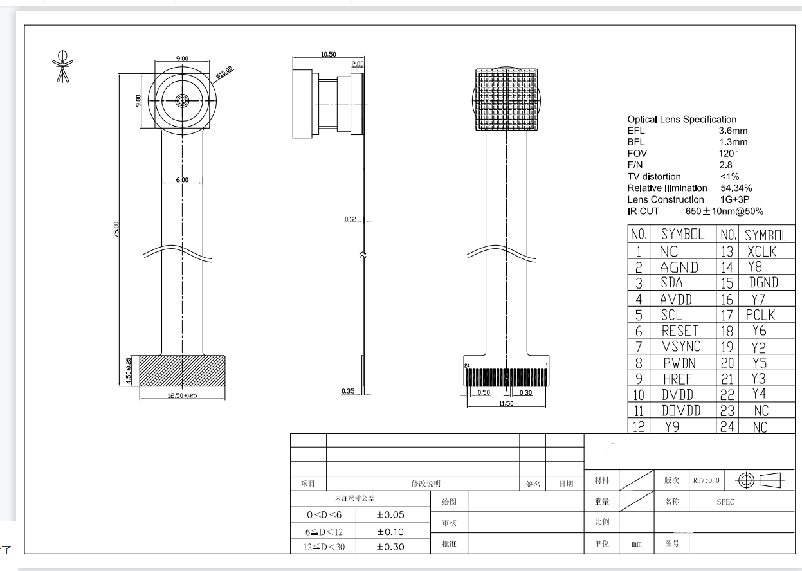
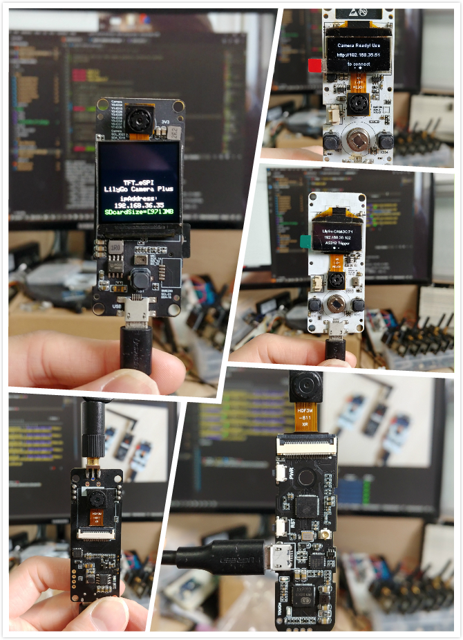

<h1 align = "center">🌟 LILYGO Camera Project🌟</h1>

## 📷 Product

|      Pin table       |      Product      |       schematic        | Status |
| :------------------: | :---------------: | :--------------------: | :----: |
|    [T-SIMCAM][1]     | [aliexpress][1-1] |    [T_SIMCAM][1-2]     |   ✅    |
| [T-Carmer V1.6.2][2] |     Obsolete      | [T-Carmer V1.6.2][2-2] |   ❌    |
|  [T-Carmer V1.7][3]  |     Obsolete      |  [T-Carmer V1.7][3-2]  |   ❌    |
|  [T-Camera Mini][4]  |     Obsolete      |  [T-Camera Mini][4-2]  |   ❌    |
|  [T-Camera Plus][5]  | [aliexpress][5-1] |  [T-Camera Plus][5-2]  |   ✅    |
|    [T-Journal][6]     | [aliexpress][6-1]|    [T-Journal][6-2]    |   ✅    |
|  [T-Carmer V1.6][7]  |     Obsolete      |        Obsolete        |   ❌    |
|  [T-Carmer V0.5][8]  |     Obsolete      |        Obsolete        |   ❌    |

[1]: docs/T_SIMCAM.md
[1-1]: https://www.aliexpress.com/item/3256804364693284.html
[1-2]: schematic/T_SIMCAM-V1.0_Schematic.pdf
[2]: docs/T_CarmerV162.md
[2-1]: https://www.aliexpress.com/item/32968683765.html
[2-2]: schematic/T_CameraV162_Schematic.pdf
[3]: docs/T_CarmerV17.md
[3-1]: https://www.aliexpress.com/item/32968683765.html
[3-2]: schematic/T_CameraV17_Schematic.pdf
[4]: docs/T_CameraMini.md
[4-1]: https://www.aliexpress.com/item/4000329886104.html
[4-2]: schematic/T_CameraMini_Schematic.pdf
[5]: docs/T_CameraPlus.md
[5-1]: https://www.aliexpress.com/item/32971057846.html
[5-2]: schematic/T_CameraPlus_Schematic.pdf
[6]: docs/T_Joranl.md
[6-1]: https://www.aliexpress.com/item/32952409255.html
[6-2]: schematic/T_Jornal_Schematic.pdf
[7]: docs/T_CarmerV16.md
[8]: docs/T_CarmerV05.md

# Quick start ⚡

## PlatformIO Quick Start 

1. Install [Visual Studio Code](https://code.visualstudio.com/) and [Python](https://www.python.org/)
2. Search for the `PlatformIO` plugin in the `VisualStudioCode` extension and install it.
3. After the installation is complete, you need to restart `VisualStudioCode`
4. After restarting `VisualStudioCode`, select `File` in the upper left corner of `VisualStudioCode` -> `Open Folder` -> select the `LilyGo-Camera-Series` directory
5. Wait for the installation of third-party dependent libraries to complete
6. Click on the `platformio.ini` file, and in the `platformio` column
7. Select the board name you want to use in `default_envs` and uncomment it.
8. Uncomment one of the lines `src_dir = xxxx` to make sure only one line works
9. Click the (✔) symbol in the lower left corner to compile
10. Connect the board to the computer USB
11. Click (→) to upload firmware
12. Click (plug symbol) to monitor serial output
13. If it cannot be written, or the USB device keeps flashing, please check the **FAQ** below

## 📷 Camera Spec

## 📘 Other

- [YouTube](https://www.youtube.com/watch?v=CibcsmurTbo)

## 🖼 Product Picture

